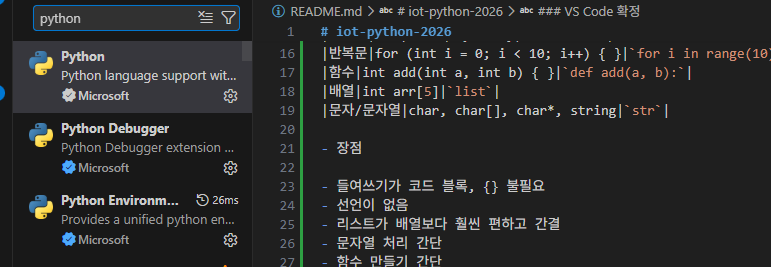
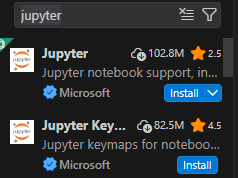
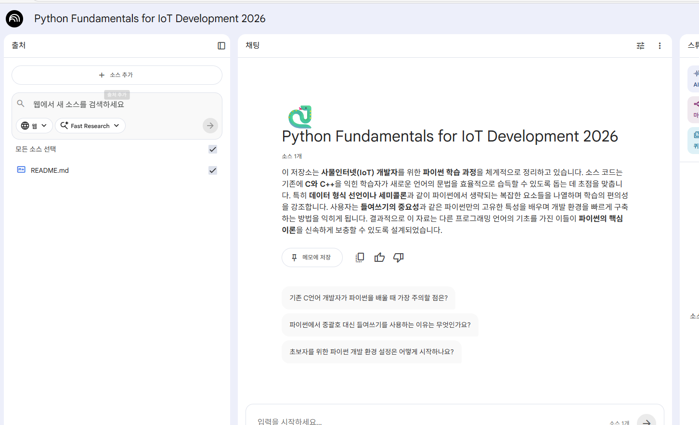
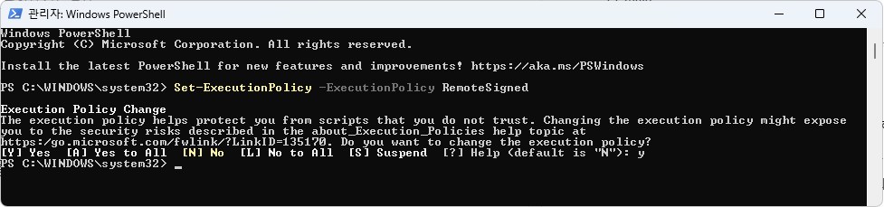
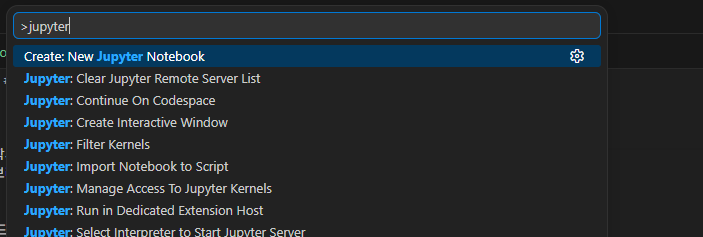
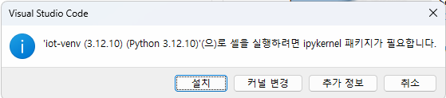

# iot-python-2026
IoT개발자 파이썬 리포지토리

- 문법 비교표

|이론개념|C/C++|Python|
|--------|-----|------|
|출력|print(), cout|`print()`|
|변수 선언|int a = 10;|`a = 10`|
|조건문|if (a > b) { ... }|`if a > b:`|
|반복문|for (int i = 0; i < 10; i++) { }|`for i in range(10):`|
|함수|int add(int a, int b) { }|`def add(a, b):`|
|배열|int arr[5]|`list`|
|문자/문자열|char, char[], char*, string|`str`|

- 장점

- 들여쓰기가 코드 블록, {} 불필요
- 선언이 없음
- 리스트가 배열보다 훨씬 편하고 간결
- 문자열 처리 간단
- 함수 만들기 간단

### 파이썬 설치

https://www.python.org/downloads/ - 다운로드
    최신 버전은 지양
    - 3.12페이지 검색해서 windows installer 64bit 클릭

    - 

- documention만 체크 해제
- Advanced Options에서 install Python 3.12 for all users 활성화
- 콘솔에서 확인 안되면 add python.exe to PATH 체크가 안된것

### VS Code 확정
- 확장
    - Python으로 검색 후 설치
    

    -jupyter 검색 후 설치
    

    ### 파이썬 기본 학습
    1. 기본 입출력
        - .py 파일 작성
        - Ctrl +F5 파일 실행
        - 디버거 선택 >Python Debugger를 선택

    2. 리스트(배열 대체)
        - append ~ sort까지 11개 함수만 학습   

    3. 제어문

## 2일차

### 파일 입출력
인코딩 
    - EUC-KR:2바이트 한글 완성형 인코딩,cp949 동일한 의미
    - UTF-8: 1바이트 영문,3바이트 한글, 4바이트 이모지등 최대 4바이트 사용

- csv
    - 엑셀과 호화가능한 텍스트 팡리

- JSON: JavaScript Object Notation: 자바스크립트에서 데이터를 사용하기 위해 만든 표기 방법
- 딕셔너리를 텍스트화
- 데이터를 네트워크로 전달 할때 가장 효율적인 파일 형식
- XML을 대체하는 기술

### NoteBookLM 사용
 - notebooklm.google.com
 - 새로 만들기 클릭
 - 필요한 웹 사이트나 자료 업로드
  

  ## 3일차
  ### 파이썬 기본 학습
  - 라이브러리 사용 계속    
    - 타 언어의 경우 웹 검색, 다운로드, 개발위치 설치 혹은 복사
    - CPU 아키텍처에 따라 32bit(x86), 64bit마다 설치 방법이 상이하다
    - 파이썬은 자신만의 패키지 관리자(Package Manager: pip) 사용
    - 웹 검색 후 pip 명령어로 각 파이썬 개발 환경에 맞춰서 설치

    ''' bash
    pip install requests
    '''
    
    - 기타 자료 구조[소스](./day03/ex13_datastruct.py)
        - 리스트 외 튜플, 딕셔너리,셋등...
        - 각 자료 구조 형태를 구분

- main[소스](./day03/ex14_main.py)
    - 파이썬은 main함수가 필요 없음
    - 여러 파일중 시작점을 지칭 할때는 사용
    - '__name__' 특수 변수를 사용

- 가상 환경
    - 프로젝트 마다 파이썬 환경을 따로 사용학시 위해 만들어진 개념
    - 프로젝트 생성시 독립도니 파이썬, 라이브러리 세트 새로 생성    
    - 일반적으로 프로젝트 폴더에서 생성

    - 파워 쉘 실행 정책 변경 필요(관리자 모드)

    ''' bash
        > Set-ExecutionPolicy -ExecutionPolicy RemoteSigned
        > python -m venv iot-venv(가상환경이름)
    '''
    - 가상환경 생성 후 가상 환경 활성화 해야 함
    

    - 가상 환경은 github에 올리지 말것

    
- 객체 지향[소스1](./day03/ex15_oop.py)
    - c++의 객체 지향, 클래스와 동일
    - 접근 제한자가 없음(public,privated,protected)
    - C++과 달리 new 안씀, 변수등 선언 제약 사항이 많이 없음
    - 클래스 내의 모든 함수의 첫번째 파라미터는 `self`로 시작, c++의 this와 동일
    - 호출 시에는 

  ### 주피터 노트북 [소스](ex20_jupyter.ipynb)
    - 파이썬을 좀더 인터렉티브하게 사용하고자 하는 취지
    - Project Jupyter
    - 확장에서 Jupyter 설치
    - 논문처럼 글과 소스 실행을 병행

    - 사용법
        - 명령 팔레트(Ctrl + Shift + P)
        
        - Untitled-1.ipynb 생성
        - 커널 선택 클릭
        - 마크다운 쉘(일반적 설명글), 코드쉘로 구분

    - 주피터 노트북 단축키
        - a: 현재 쉘위에 코드 쉘 추가
        - b: 현재 쉘 아래에 코드쉘 추가됨
        - enter: 현재 쉘 편집 모드로 진입
        - Ctrl + Enter: 마크 다운 쉘을 빠져 나오기, 코드 쉘을 실행
        

        -dd: 쉘 선택모드에서 쉘 삭제

        - 사용처
            - 웹상에서 동적하므로 많은 서비스를 지원
            - github codespace = 기존 리포지토리와 연결 지원
    

    ### 데이터 분석 기초
        - 리스트,튜플,딕셔너리
        - 리스트 컴프리헨션
        - 파일 입출력
        - Numpy
        - Pandas
        - Matplotlib
        - Seaborn
        - Folium
        - WordCloud
        - 기초 통계
        -데이터 전처기

## 4일차
### 데이터 분석 기초
  - 리스트 컴프리헨션
        - 파일 입출력
        - Numpy
        - Pandas[노트북](./day04_1/ex22_dataprocess.ipynb)
        - Matplotlib
        - Seaborn [노트북](./day04_1/ex23_dataprocess.ipynb)
        - Folium[노트북](./day04_1/ex24_map_vis.ipynb)
        - WordCloud[노트북](./day04_1/ex25_wordcloud.ipynb)
        - 기초 통계
        -데이터 전처기

- 데이터 분석 이유
    - 인사이트: 특정한 맥락 속에서 특정 원인이나 효과를 이해하는것
    - 방대한 데이터 속에서 패턴이나 인사이트를 도출, `합리적인 의사 결정`,`고객 행동 예측`,`운영 효율화`,`신규 비즈니스 기회 창출`등을 하는 핵심 도구
        - 데이터 기반의 의사 결정 가능
        - 고객 이해도 증가
        - 운영 효율성 및 비용 절감
        - 트랜드 파악 및 경쟁력 강화
        - 미래 예측

- 데이터 분석
    - 인사이트(Insight) : 특정한 맥락 속에서 특정 원인이나 효과를 이해하는 것
    - 방대한 데이터 속에서 패턴이나 인사이트(통찰)를 도출 , 합리적인 의사결정 , 고객 행동 예측 , 운영 효율화 , 신규 비즈니스 기회 창출 등을 하는 핵심 도구
    - 데이터 기반의 의사결정 가능
    - 고객 이해도 증가
    - 운영 효율성 및 비용 절감
    - 트렌드 파악 및 경쟁력 강화
    - 미래 예측

- 기초 통계
    - 평균(mean)
    - 중앙값(50%)
    - 최빈값(Mode) : 가장 많이 나온값, wordcloud에서 가장 많이 나온 값을 크게 표시
    - 분산(Variance) - 데이터가 얼마나 퍼져 있는지, 평균으로 부터의 거리의 평균
    - 표준 편차(Standard Deviation) - 분산의 제곱근
    - 최솟값/최댓값 - 범위 파악
    - 사분위수 - 데이터를 4등분,Q1(25%),Q2(50% median),Q3(75%)
    - `상관계수` - 두 데이터의 관계, 1(강한 양의 관계), 0(관계 없음) -1(반대 관계)

- 데이터 전처리
    - 분석/모델 처리 전에 데이터를 정리하는 과정
    - 전체 데이터 분석 시간 60~80%가 전처리에 사용
    - 도메인(특정 비즈니스)에 따라 이해도
    - 수정하고 돌리고 또 수정...
- 현실 데이터의 문제
    - 데이터 구조가 제각각(json, csv, db, ...)
    - 값이 비어 있음(결측치)
    - 이상한 값이 있음(이상치)
    - 단위도 제각각
    - 숫자와 문자가 뒤섞임
    - 위와 같은 데이터를 분석이나 머신러닝/딥러닝에 넣으면 처리가 엉망이 됨
- 전처리 핵심 4단계
    - 결측치 처리
    - 이상치 처리
    - 스케일링
    - 인코딩
- 결측치
    - 전체 데이터(해당컬럼)에서 10% 정도의 결측치가 있으면 다른값(평균, 최소, 최대, 중앙값...)으로 채워넣음. 실무에서는 평균, 중앙값 많이 사용
        - 40% 이상의 결측치를 가지면, 이 컬럼은 삭제. 분석에서 제외
이상치
    - 단순 제거
    - 사분위수를 사용, 통계 기반으로 제거
    - 스케일링
    - 값의 범위를 맞추는 것
    - 표준화, 정규화
인코딩
    - 문자를 숫자로 변환
    예. male, female 은 분석불가 → 0, 1 (수, 분포...) 수치적인 통계 가능
    One-Hot Encoding, male[1, 0, 0], female[0, 1, 0], child[0, 0, 1]

## 5일차

### 영상 처리

- 개요
    - 이미지를 컴퓨터 분석하고 변환 하는 분야
    - 동영상: 연속된 이미지 + 음성
    - 음성은 제외 하고 연속 영상만 사용
    - 초당 이미지를 여러개 변경해서 만들어지는것: 보통 1초에 30개 이미지가 변경

    - Frame: 동영상에서 하나씩 변경되는 이미지
    - FPS: Frame Per Second, 1초당 뿌려지는 이미지수
    - 영상 처리는 이미지, 동영상 모두 분석하고 변호나 처리 하는것
    - 컴퓨터 비전 - 영상 처리를 컴퓨터로 처리

- OpenCV
    - 오픈 소스 컴퓨터 비전 라이브러리
    - 독립적 OS 플랫폼에서 사용가능
    - C로 개발 C++로 변경
    - 모든 언어에서 사용할수 있도록 래핑 라이브러리가 존재

- OpenCV Python
    - OpenCV를 파이썬에 사용하도록 만든 래핑 라이브러리
    - 코드가 간결하고 AI/딥러닝과 연결 쉬움, 데이너 분석 통합 가능
    - C++ OpenCV보다는 속도가 느리다. -> PyTorch로 속도 개선

- VLC
    - 영상 처리 쪽 코덱이 필요
    

